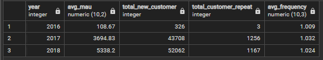
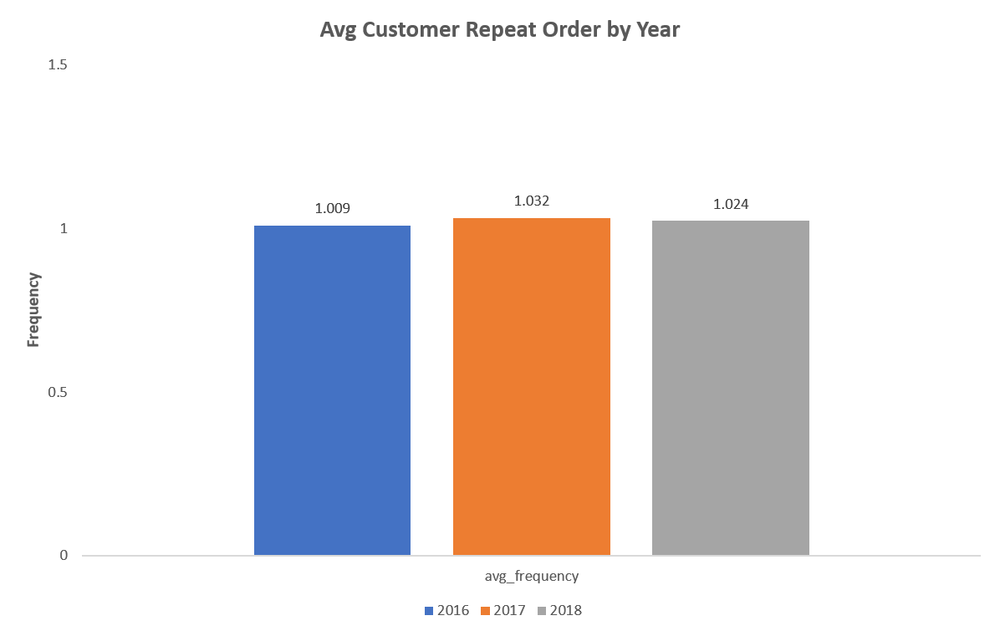

## 📂 **STAGE 1: Problem Statement**

### **Background Story**
Perusahaan ini merupakan salah satu marketplace terbesar di Amerika Selatan yang menghubungkan pelaku bisnis mikro dengan para pelanggannya. Sebagai anggota dari tim Data Analytics, saya mendapatkan tanggung jawab untuk menganalisis tiga aspek yang berkaitan dengan performa bisnis perusahaan tersebut. Ketiga aspek tersebut di antaranya adalah **pertumbuhan pelanggan**, **kualitas produk** dan **tipe pembayaran**. saya akan mengolah data yang sudah disediakan untuk membuat laporan performa bisnis pada ketiga aspek tersebut.

### **Objective**
Mengumpulkan insight dari analisis dan dengan visualisasi berupa :
1. **Annual Customer Activity Growth**
2. **Annual Product Category Quality**
3. **Annual Payment Type Usage**

---


## 📂 **STAGE 2: Data Preparation**

Dataset yang digunakan adalah dataset sebuah perusahaan eCommerce Brasil yang memiliki informasi pesanan dengan jumlah 99441 dari tahun 2016 hingga 2018. Terdapat fitur-titur yang membuat informasi seperti status pemesanan, lokasi, rincian item, jenis pembayaran, serta ulasan.

### **Create Database and ERD**
**Langkah-langkah yang dilakukan meliputi:**
1. Membuat workspace database di dalam pgAdmin dan membuat tabel menggunakan `CREATE TABLE` statement
2. Melakukan import data csv kedalam database
3. Menentukan Primary Key atau Foreign Key enggunakan statement `ALTER TABLE`
4. Membuat dan mengeksport ERD (Entity Relationship Diagram) <br>

<details>
  <summary>Click untuk melihat Queries</summary>
  
  ```sql
-- 1) Membuat database melalui klik kanan Databases > Create > Database.. dengan nama ecommerce_miniproject


-- 2) Membuat tabel dan menentukan foreign key menggunakan statement CREATE TABLE dengan mengikuti penamaan kolom di csv dan memastikan tipe datanya sesuai.

CREATE TABLE customers_dataset (
	customer_id varchar primary key,
	customer_unique_id varchar,
	customer_zip_code_prefix varchar,
	customer_city varchar,
	customer_state varchar
);

CREATE TABLE sellers_dataset (
	seller_id varchar primary key,
	seller_zip_code_prefix varchar,
	seller_city varchar,
	seller_state varchar
);

CREATE TABLE geolocation_dataset (
	geolocation_zip_code_prefix varchar primary key,
	geolocation_lat decimal,
	geolocation_lng decimal,
	geolocation_city varchar,
	geolocation_state varchar
);

CREATE TABLE product_dataset (
	product_id varchar primary key,
	product_category_name varchar,
	product_name_lenght int,
	product_description_lenght int,
	product_photos_qty int,
	product_weight_g decimal,
	product_length_cm decimal,
	product_height_cm decimal,
	product_width_cm decimal
);

CREATE TABLE orders_dataset (
	order_id varchar primary key,
	customer_id varchar,
	order_status varchar,
	order_purchase_timestamp timestamp,
	order_approved_at timestamp,
	order_delivered_carrier_date timestamp,
	order_delivered_customer_date timestamp,
	order_estimated_delivery_date timestamp
);

CREATE TABLE order_items_dataset (
	order_id varchar,
	order_item_id int primary key,
	product_id varchar,
	seller_id varchar,
	shipping_limit_date timestamp,
	price decimal,
	fright_value decimal
);

CREATE TABLE order_payments_dataset (
	order_id varchar,
	payment_sequential int,
	payment_type varchar,
	payment_installments int,
	payment_value decimal
);

CREATE TABLE order_reviews_dataset (
	review_id varchar primary key,
	order_id varchar,
	review_score int,
	review_comment_title varchar,
	review_comment_message varchar,
	review_creation_date timestamp,
	review_answer_timestamp timestamp
);

-- 3) Mengimpor file csv ke dalam masing-masing tabel yang telah dibuat dengan klik kanan pada nama tabel > Import/Export Data.

-- 4). Foreign Key

ALTER TABLE orders_dataset ADD FOREIGN KEY (customer_id) REFERENCES customers_dataset;
ALTER TABLE order_payments_dataset ADD FOREIGN KEY (order_id) REFERENCES orders_dataset;
ALTER TABLE order_reviews_dataset ADD FOREIGN KEY (order_id) REFERENCES orders_dataset;
ALTER TABLE order_items_dataset ADD FOREIGN KEY (order_id) REFERENCES orders_dataset;
ALTER TABLE order_items_dataset ADD FOREIGN KEY (product_id) REFERENCES product_dataset;
ALTER TABLE order_items_dataset ADD FOREIGN KEY (seller_id) REFERENCES sellers_dataset;

-- 5) Membuat ERD dengan cara klik kanan pada database ecommerce_miniproject > Gererate ERD.

  ```
</details>

**Hasil ERD :** <br>
<p align="center">
  <kbd> </kbd> <br>
  Gambar 1. Entity Relationship Diagram
</p>
<br>
<br>

---
## 📂 **STAGE 2: Data Analysis**

### **1. Annual Customer Activity Growth**
Pertumbuhan aktivitas pelanggan tahunan dapat dianalisis dari Monthly active user (MAU), pelanggan baru, pelanggan dengan repeat order, dan rata-rata order oleh pelanggan.

<details>
  <summary>Click untuk melihat Queries</summary>
  
  ```sql
 --1 Menampilkan rata-rata jumlah customer aktif bulanan (monthly active user) untuk setiap tahun
SELECT year, FLOOR(AVG(customer_total)) AS avg_mau
FROM (
	SELECT 
		date_part('year', od.order_purchase_timestamp) AS year,
		date_part('month', od.order_purchase_timestamp) AS month,
		COUNT(DISTINCT cd.customer_unique_id) AS customer_total
	FROM orders_dataset AS od
	JOIN customers_dataset AS cd
		ON cd.customer_id = od.customer_id
	GROUP BY 1, 2
	) AS sub
GROUP BY 1
ORDER BY 1
;

--2 Menampilkan jumlah customer baru pada masing-masing tahun
SELECT year, COUNT(customer_unique_id) AS total_new_customer
FROM (
	SELECT
		Min(date_part('year', od.order_purchase_timestamp)) AS year,
		cd.customer_unique_id
	FROM orders_dataset AS od
	JOIN customers_dataset AS cd
		ON cd.customer_id = od.customer_id
	GROUP BY 2
	) AS sub
GROUP BY 1
ORDER BY 1
;

--3 Menampilkan jumlah customer repeat order pada masing-masing tahun
SELECT year, count(customer_unique_id) AS total_customer_repeat
FROM (
	SELECT
		date_part('year', od.order_purchase_timestamp) AS year,
		cd.customer_unique_id,
		COUNT(od.order_id) AS total_order
	FROM orders_dataset AS od
	JOIN customers_dataset AS cd
		ON cd.customer_id = od.customer_id
	GROUP BY 1, 2
	HAVING count(2) > 1
	) AS sub
GROUP BY 1
ORDER BY 1
;

--4 Menampilkan rata-rata jumlah order yang dilakukan customer untuk masing-masing tahun
SELECT year, ROUND(AVG(freq), 3) AS avg_frequency
FROM (
	SELECT
		date_part('year', od.order_purchase_timestamp) AS year,
		cd.customer_unique_id,
		COUNT(order_id) AS freq
	FROM orders_dataset AS od
	JOIN customers_dataset AS cd
		ON cd.customer_id = od.customer_id
	GROUP BY 1, 2
	) AS sub
GROUP BY 1
ORDER BY 1
;

--5 Menggabungkan ketiga metrik yang telah berhasil ditampilkan menjadi satu tampilan tabel
WITH cte_mau AS (
	SELECT year, FLOOR(AVG(customer_total)) AS avg_mau
	FROM (
		SELECT 
			date_part('year', od.order_purchase_timestamp) AS year,
			date_part('month', od.order_purchase_timestamp) AS month,
			COUNT(DISTINCT cd.customer_unique_id) AS customer_total
		FROM orders_dataset AS od
		JOIN customers_dataset AS cd
			ON cd.customer_id = od.customer_id
		GROUP BY 1, 2
		) AS sub
	GROUP BY 1
),

cte_new_cust AS (
	SELECT year, COUNT(customer_unique_id) AS total_new_customer
	FROM (
		SELECT
			Min(date_part('year', od.order_purchase_timestamp)) AS year,
			cd.customer_unique_id
		FROM orders_dataset AS od
		JOIN customers_dataset AS cd
			ON cd.customer_id = od.customer_id
		GROUP BY 2
		) AS sub
	GROUP BY 1
),

cte_repeat_order AS (
	SELECT year, count(customer_unique_id) AS total_customer_repeat
	FROM (
		SELECT
			date_part('year', od.order_purchase_timestamp) AS year,
			cd.customer_unique_id,
			COUNT(od.order_id) AS total_order
		FROM orders_dataset AS od
		JOIN customers_dataset AS cd
			ON cd.customer_id = od.customer_id
		GROUP BY 1, 2
		HAVING count(2) > 1
		) AS sub
	GROUP BY 1
),

cte_frequency AS (
	SELECT year, ROUND(AVG(freq), 3) AS avg_frequency
	FROM (
		SELECT
			date_part('year', od.order_purchase_timestamp) AS year,
			cd.customer_unique_id,
			COUNT(order_id) AS freq
		FROM orders_dataset AS od
		JOIN customers_dataset AS cd
			ON cd.customer_id = od.customer_id
		GROUP BY 1, 2
		) AS sub
	GROUP BY 1
)

SELECT
	mau.year AS year,
	avg_mau,
	total_new_customer,
	total_customer_repeat,
	avg_frequency
FROM
	cte_mau AS mau
	JOIN cte_new_cust AS nc
		ON mau.year = nc.year
	JOIN cte_repeat_order AS ro
		ON nc.year = ro.year
	JOIN cte_frequency AS f
		ON ro.year = f.year
GROUP BY 1, 2, 3, 4, 5
ORDER BY 1
;
  ```
</details>

<p align="center">
  <kbd> </kbd> <br>
  Tabel 1. Hasil Analisis Pertumbuhan Aktivitas Pelanggan Tahunan
</p>

<br>
<p align="center">
  <kbd> </kbd> <br>
  Gambar 2. Grafik Rata-rata MAU dan Pelanggan Baru
</p>

Secara keseluruhan perusahaan mengalami peningkakatan Monthly Active User serta pelanggan baru setiap tahunnya. Peningkatan yang signifikan terjadi pada tahun 2016 ke 2017, hal ini dikarenakan data transaksi pada tahun 2016 dimulai pada bulan September. <br>
<br>
<br>

<p align="center">
  <kbd> </kbd> <br>
  Gambar 3. Grafik Jumlah Pelanggan yang Melakukan Repeat Order
</p>

Peningkatan yang signifikan juga terjadi pada jumlah pelanggan yang melakukan repeat order pada tahun 2016 hingga 2017. Namun pada tahun 2018 mengalami sedikit penurunan. <br>
<br>
<br>


<p align="center">
  <kbd> </kbd> <br>
  Gambar 4. Grafik Rata-rata Frekuensi Order Pelanggan
</p>

Dari analisis dan grafik diatas dapat diketahui bahwa rata-rata pelanggan setiap tahunnya cenderung hanya melakukan order satu kali, artinya mayoritas pelanggan tidak melakukan repeat order.<br>
<br>

### **2. Annual Product Category Quality**

Kualitas kategori produk tahunan dapat dianalisis dari total pendapatan, total pembatalan pesanan, kategori top produk dan kategori produk yang paling banyak dibatalkan.

<details>
  <summary>Click disini untuk melihat Queries</summary>

  ```sql
 --1) Membuat tabel yang berisi informasi pendapatan/revenue perusahaan total untuk masing-masing tahun
CREATE TABLE total_revenue AS
	SELECT
		date_part('year', od.order_purchase_timestamp) AS year,
		SUM(oid.price + oid.fright_value) AS revenue
	FROM order_items_dataset AS oid
	JOIN orders_dataset AS od
		ON oid.order_id = od.order_id
	WHERE od.order_status like 'delivered'
	GROUP BY 1
	ORDER BY 1;

--2) Membuat tabel yang berisi informasi jumlah cancel order total untuk masing-masing tahun
CREATE TABLE canceled_order AS
	SELECT
		date_part('year', order_purchase_timestamp) AS year,
		COUNT(order_status) AS canceled
	FROM orders_dataset
	WHERE order_status like 'canceled'
	GROUP BY 1
	ORDER BY 1;
		
--3) Membuat tabel yang berisi nama kategori produk yang memberikan pendapatan total tertinggi untuk masing-masing tahun
CREATE TABLE top_product_category AS
	SELECT 
		year,
		top_category,
		product_revenue
	FROM (
		SELECT
			date_part('year', shipping_limit_date) AS year,
			pd.product_category_name AS top_category,
			SUM(oid.price + oid.fright_value) AS product_revenue,
			RANK() OVER (PARTITION BY date_part('year', shipping_limit_date)
					 ORDER BY SUM(oid.price + oid.fright_value) DESC) AS ranking
		FROM orders_dataset AS od 
		JOIN order_items_dataset AS oid
			ON od.order_id = oid.order_id
		JOIN product_dataset AS pd
			ON oid.product_id = pd.product_id
		WHERE od.order_status like 'delivered'
		GROUP BY 1, 2
		ORDER BY 1
		) AS sub
	WHERE ranking = 1;
	
--4) Membuat tabel yang berisi nama kategori produk yang memiliki jumlah cancel order terbanyak untuk masing-masing tahun
CREATE TABLE most_canceled_category AS
	SELECT 
		year,
		most_canceled,
		total_canceled
	FROM (
		SELECT
			date_part('year', shipping_limit_date) AS year,
			pd.product_category_name AS most_canceled,
			COUNT(od.order_id) AS total_canceled,
			RANK() OVER (PARTITION BY date_part('year', shipping_limit_date)
					 ORDER BY COUNT(od.order_id) DESC) AS ranking
		FROM orders_dataset AS od 
		JOIN order_items_dataset AS oid
			ON od.order_id = oid.order_id
		JOIN product_dataset AS pd
			ON oid.product_id = pd.product_id
		WHERE od.order_status like 'canceled'
		GROUP BY 1, 2
		ORDER BY 1
		) AS sub
	WHERE ranking = 1;
	
-- Tambahan - Menghapus anomali data tahun
DELETE FROM top_product_category WHERE year = 2020;
DELETE FROM most_canceled_category WHERE year = 2020;

-- Menampilkan tabel yang dibutuhkan
SELECT 
	tr.year,
	tr.revenue AS total_revenue,
	tpc.top_category AS top_product,
	tpc.product_revenue AS total_revenue_top_product,
	co.canceled total_canceled,
	mcc.most_canceled top_canceled_product,
	mcc.total_canceled total_top_canceled_product
FROM total_revenue AS tr
JOIN top_product_category AS tpc
	ON tr.year = tpc.year
JOIN canceled_order AS co
	ON tpc.year = co.year
JOIN most_canceled_category AS mcc
	ON co.year = mcc.year
GROUP BY 1, 2, 3, 4, 5, 6, 7;
  ```
</details>

<p align="center">
  Tabel 2. Hasil Analisis Total Kategori Produk Tahunan <br>
  <kbd> </kbd> <br>
</p>

<br>
<p align="center">
  <kbd> </kbd> <br>
  Gambar 5. Grafik Total Revenue Pertahun
</p>

Secara keseluruhan revenue perusahaan meningkat setiap tahun. <br>
<br>
<br>

<p align="center">
  <kbd> </kbd> <br>
  Gambar 6. Grafik Total Revenue Top Produk Pertahun
</p>

Revenue yang dihasilkan dari top produk juga meningkat untuk setiap tahunnya. Selain itu setiap tahunnya memiliki jenis kategori top produk yang berbeda. Pada tahun 2018, perusahaan menghasilkan revenue paling tinggi dengan jenis karegori top produk kesehatan dan kecantikan (`health_beauty`). <br>
<br>
<br>

<p align="center">
  <kbd> </kbd> <br>
  Gambar 7. Grafik Total Revenue Top Produk Pertahun
</p>

Produk yang sering dibatalkan oleh pelanggan untuk setiap tahunnya juga memiliki jenis kategori yang berbeda dan terus mengalami kenaikan. Tahun 2018 memiliki jumlah produk yang dibatalkan paling banyak dan memiliki jenis kategori yang sama dengan top produk yang paling banyak menghasilkan revenue. Hal tersebut dapat diduga karena jenis kategori kesehatan dan kecantikan sedang mendominasi pasar.  <br>
<br>
